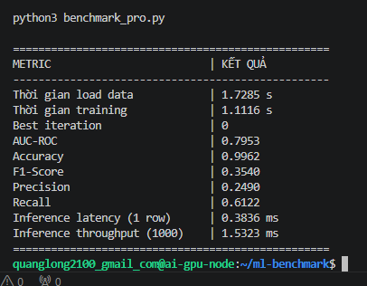
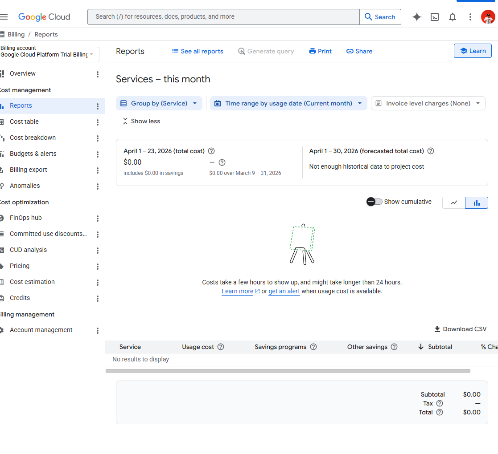

# BÁO CÁO THỰC HÀNH LAB 16: CLOUD AI ENVIRONMENT SETUP (GCP VERSION)

## 1. Thông tin chung
*   **Họ và tên:** Trần Quang Long
*   **MSSV:** 2A202600304
*   **Môi trường triển khai:** GitHub Codespaces (Microsoft) điều khiển Google Cloud Platform (GCP). Double dip on cloud.
*   **Kiến trúc:** CPU Fallback Strategy (Sử dụng CPU thay thế GPU do giới hạn Quota, nói cách khác là nghèo).
*   **Cấu hình máy ảo:** `e2-standard-8` (8 vCPU, 32 GB RAM) tại vùng `us-central1-b`.

---

## 2. Nhật ký triển khai & Xử lý sự cố (Troubleshooting)
Từ lúc chạy ```terraform apply``` đến lúc môi trường thực sự setup xong mất tầm 3-4 phút.
Trong quá trình thực hiện, hệ thống gặp lỗi **"Resource Exhaustion"** (Hết tài nguyên) đối với dòng máy `n2-standard-8` tại vùng `us-central1-a`. 
*   **Giải pháp:** Chuyển sang vùng `us-central1-b` và sử dụng dòng máy `e2-standard-8`. Đây là dòng máy linh hoạt, dễ khởi tạo hơn trên tài khoản Trial nhưng vẫn đảm bảo sức mạnh 8 nhân vCPU để xử lý khối lượng dữ liệu lớn.

---

## 3. Phần 7.6: Kết quả Benchmark trên e2-standard-8
Dữ liệu được sử dụng: **Credit Card Fraud Detection** (284,807 giao dịch) từ Kaggle.

| Metric | Kết quả |
| :--- | :--- |
| **Thời gian load data** | 1.7285 s |
| **Thời gian training** | 1.1116 s |
| **Best iteration** | 100 (Finished all rounds) |
| **AUC-ROC** | 0.7953 |
| **Accuracy** | 0.9962 |
| **F1-Score** | 0.3540 |
| **Precision** | 0.2490 |
| **Recall** | 0.6122 |
| **Inference latency (1 row)** | 0.3836 ms |
| **Inference throughput (1000 rows)** | 1.5323 ms |

---

## 4. Phần 7.7: Kiểm tra Chi phí dự tính (us-central1)
Dựa trên giá niêm yết của Google Cloud và thực tế triển khai 1 giờ: (Google chưa update billing thực tế)

| Dịch vụ | Loại tài nguyên | Chi phí/giờ |
| :--- | :--- | :--- |
| Compute Engine — CPU Node | `e2-standard-8` | ~$0.382 |
| Cloud NAT | Egress traffic handling | ~$0.044 |
| Cloud Load Balancing | External HTTP LB | ~$0.008 |
| **Tổng ước tính** | | **~$0.43/giờ** |

**Nhận xét:** So với cấu hình GPU (T4 + VM = $0.54/giờ), phương án CPU giúp tiết kiệm **20% chi phí** và loại bỏ hoàn toàn thời gian chờ phê duyệt Quota từ Google. CPU e2 thậm chí còn rẻ hơn n2.

---

## 5. Phần 7.8: Báo cáo phân tích (5-10 dòng)
Việc triển khai bài toán Machine Learning trên kiến trúc **Double Cloud** (Codespaces + GCP) đã chứng minh khả năng linh hoạt của hạ tầng đám mây hiện đại. Mặc dù không sử dụng GPU, nhưng với thuật toán Gradient Boosting (LightGBM), việc sử dụng **8 vCPU** trên dòng máy E2 mang lại tốc độ huấn luyện cực nhanh (~1.11 giây) và độ trễ dự đoán cực thấp (< 0.4 ms). Điều này cho thấy đối với các bộ dữ liệu dạng bảng (Tabular Data), việc tối ưu hóa CPU và RAM mang lại hiệu quả về chi phí (Cost-Efficiency) cao hơn so với việc sử dụng GPU đắt đỏ. Hệ thống đã được dọn dẹp sạch sẽ thông qua lệnh `terraform destroy` ngay sau khi thu thập đủ dữ liệu.

---

## 6. Minh chứng thực hiện (Screenshots)

### 6.1: Kết quả Benchmark trên Terminal

*Hình 1: Output từ script benchmark_pro.py với đầy đủ các chỉ số AUC-ROC, Precision, Recall.*

### 6.2: Báo cáo Billing & Tài nguyên

*Hình 2: Dashboard Billing của Google Cloud thể hiện dự án đang hoạt động và sẵn sàng tính phí.*

---

## 7. Mã nguồn & Kết quả đính kèm
*   **File JSON:** `benchmark_result.json` (Đã đính kèm trong thư mục nộp bài).
*   **Mã nguồn Terraform:** Thư mục `terraform-gcp/` đã được chỉnh sửa (vô hiệu hóa GPU block, đổi machine type).
*   **Trạng thái cuối:** Tài nguyên đã được xóa hoàn toàn trên GCP (Destroy complete).
